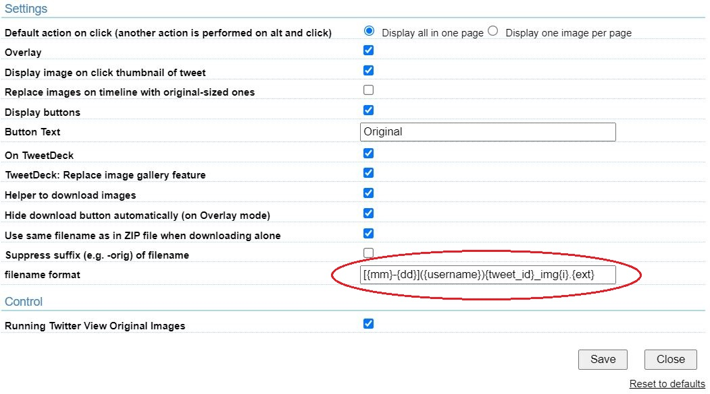

twOpenOriginalImage
========================================
- add to specify the file name format based on https://github.com/furyutei/twOpenOriginalImage (ver.0.1.8.20)

### user script (Greasemonkey / Tampermonkey）
> [smallbomb modifyー(twOpenOriginalImage.user.js)](https://github.com/smallbomb/twOpenOriginalImage/raw/master/src/js/twOpenOriginalImage.user.js) 



### example 
`[{mm}-{dd}]({username}){tweet_id}_img{i}.{ext}` => `[2021-10-06](Google)1445486492734816268_img1.jpg`

### support filename format
```js
/*    filename:
 *      {base}
 *    tweet create date:
 *      {yyyy} => fullyear
 *      {mm} => month
 *      {dd} => day
 *      {HH} => hours
 *      {MM} => minutes
 *      {SS} => seconds
 *    author:
 *      {fullname} => nickname
 *      {username} => account
 *    image index:
 *      {i} => 1, 2, ...
 *    tweet id:
 *      {tweet_id}
 *    tweet text:
 *      {twtext} => first line only
 *    suffix:
 *      {suffix} => '-orig'
 *    extension:
 *      {ext}
 */
```
